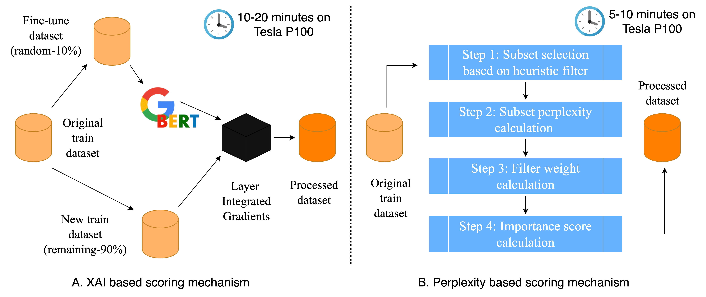

<h1 align=center> Exploring Data Augmentation Methods through Attribution

    </h1>

Data augmentation enhances model generalization by increasing training data diversity through techniques like synonym replacement, punctuation insertion, back-translation, and paraphrasing. Traditionally applied uniformly, these methods assume all training samples contribute equally. However, studies and gradient based attribution methods such as Layer Integrated Gradients (LIG) reveal that some samples have a greater influence on model performance than others. This research investigates whether augmentation can be more effective when selectively applied to subsets of training data with varying influence. Two attribution approaches are explored: (1) Captum’s LIG for text classification, and (2) a custom perplexity-based text quality filter inspired by recent Meta research for translation tasks. We evaluate the impact of applying augmentation using EDA, AEDA, and backtranslation (English ↔ French) on the top 10%, random 10%, and bottom 10% of training samples in both tasks.

In this research, we make the following contributions:

- We apply attribution and data filtering methods to extract the most and least important
samples in five text classification and five language translation tasks.
- We show that while random samples can perform as well or even better than top samples
in classification, the difference between them is more apparent in translation.
- We also show that augmenting bottom samples in classification and top samples in
translation is more effective than augmenting the other subsets.

## Project Structure

```html
|- attribution
  |-- lig.py
  |-- perplexity.py
|- augmentation
  |-- AEDA
  |-- Backtranslation
  |-- EDA
|- datasets
|- figures
  |-- assets
  |-- bert
  |-- mt5
|- train
  |-- bert.py
  |-- mT5.py
```

## Datasets

The datasets for both tasks are available as .csv files in this repository.

- **Task 1 - Text Classification**

  - SST2 - binary classification dataset
  - SST5 - multi-label classification dataset
  - IMDB - binary classification dataset
  - AGNews10K - multi-label classification dataset
  - Irony Detection (SemEval 2017) - binary classification dataset

- **Task 2 - Neural Machine Translation**

  - English to Afrikaans
  - English to Welsh
  - English to Czech
  - English to Spanish
  - English to Romanian

## Methodology

We explore two data attribution methods to identify influential training samples. For text classification, we fine-tune a BERT-base model on 10% of the data and use Layer Integrated Gradients (LIG) to compute global importance scores on the remaining 90%. Token-level attributions are aggregated per sample, with positive scores indicating helpful examples and negative scores pointing to potentially harmful ones. For translation, we implement a model-agnostic, heuristic-based filtering approach using 14 handcrafted rules related to grammar, repetition, and structure. Each sample is evaluated independently using SpaCy-based filters, and filter weights are derived using perplexity scores from an autoregressive pre-trained language model to assess their impact on overall data quality.

<p align="center">
  
</p>

## How to use?

Open terminal and run the following commands one by one

```html
mkdir Project
```
Now switch to the newly created Project directory using

```html
cd Project
```
Now clone the github repository inside your working directory using

```html
git clone https://github.com/kotiyalanurag/Exploring-Data-Augmentation-Methods-through-Attribution.git
```
Create a python virtual environment using

```html
python -m venv env
```

Activate the environment using

```html
source env/bin/activate
```

Now, load all the dependencies for the project using 

```html
pip install -r requirements.txt
```
